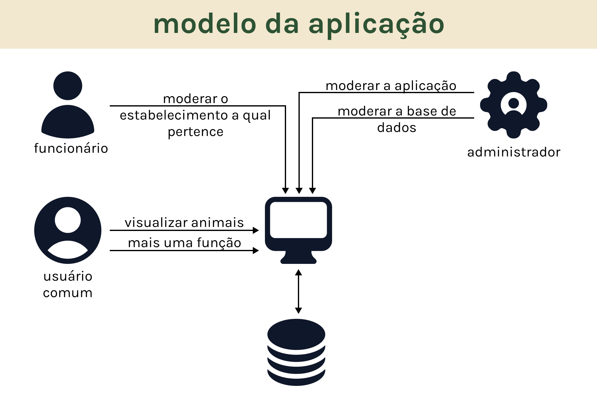
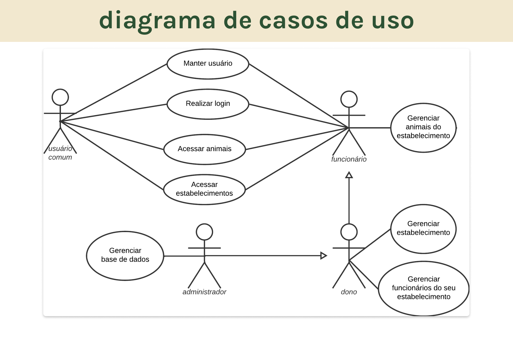
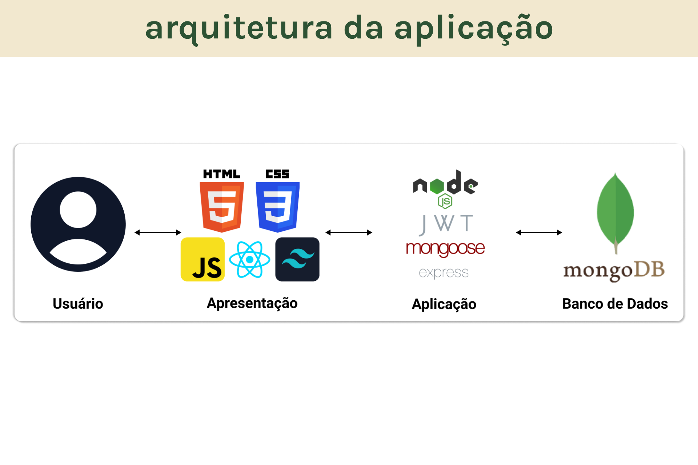
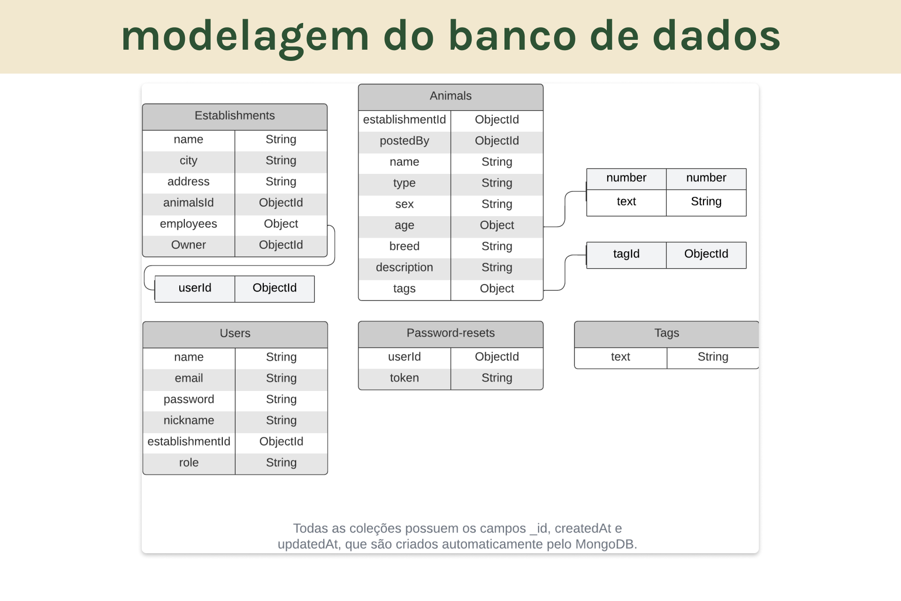
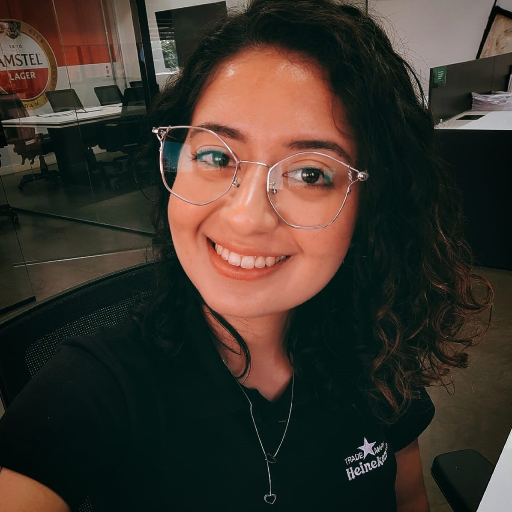

# **Projeto “*Adotei!*” - Plataforma web para auxiliar ONGs de defesa animal". 🐾**

> *Projeto desenvolvido em conjunto com a [@Maria Antonia](https://www.linkedin.com/in/maria-antonia-carpes-bastos-052560269/), tecnóloga em design gráfico!*
> 

## Sobre o projeto 🐶🐱

***Adotei*** é uma plataforma web voltada para ONGs de **defesa animal** criarem seu cadastro, postarem seus serviços e animais que possuem para adoção, como uma forma de **informar a população** próxima. Além disso, os usuários podem **agendar serviços** desejados ou **demonstrar interesse em adotar** um animal de uma das ONGs. 🏡

***O Projeto ainda está em desenvolvimento! Portanto, novas informações e fotos das telas da plataforma serão adicionadas em breve!*** 🚧

## Objetivo 🎯

Este projeto tem dois principais **objetivos**:

1. **Ajudar** as ONGs de defesa aos animais a **divulgarem** seus **serviços** e **animais** disponíveis para adoção 🐕🐈.
2. **Reforçar** os **conhecimentos** da Maria em **design gráfico** 🎨 e os meus em desenvolvimento **fullstack MERN** 💻.

## Funcionalidades ⚙️

- Cadastro de ONGs de defesa animal 📝.
- Postagem de serviços oferecidos pelas ONGs 📋.
- Listagem de animais disponíveis para adoção 🐾.
- Agendamento de serviços pelos usuários 📅.
- Demonstração de interesse na adoção de animais 🏡.

## Tecnologias Utilizadas 🛠️

- **Frontend:** React.js ⚛️
- **Backend:** Node.js, Express.js, Mongoose 🟢
- **Banco de Dados:** MongoDB 🍃
- **Autenticação:** JWT (JSON Web Tokens) 🔐
- **Estilização:** CSS, TailwindCSS 🎨

## Diagramas para a modelagem da aplicação 📝

## Imagens do Projeto

| Modelo da Aplicação | Diagrama de Casos de Uso |
|---------------------|--------------------------|
|  |  |

| Arquitetura da Aplicação | Modelagem do Banco de Dados |
|--------------------------|-----------------------------|
|  |  |

## Autores 👥

| [Maria Antonia Carpes Bastos](https://www.linkedin.com/in/maria-antonia-carpes-bastos-052560269/) | [Natan da Cruz Mendes](https://www.linkedin.com/in/natancruzmendes/) |
|---------------------|--------------------------|
|  |  |
| *Designer* | *Desenvolvedor* |